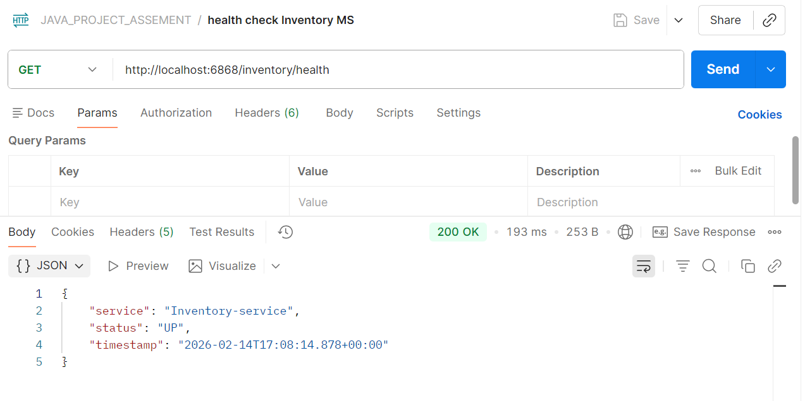
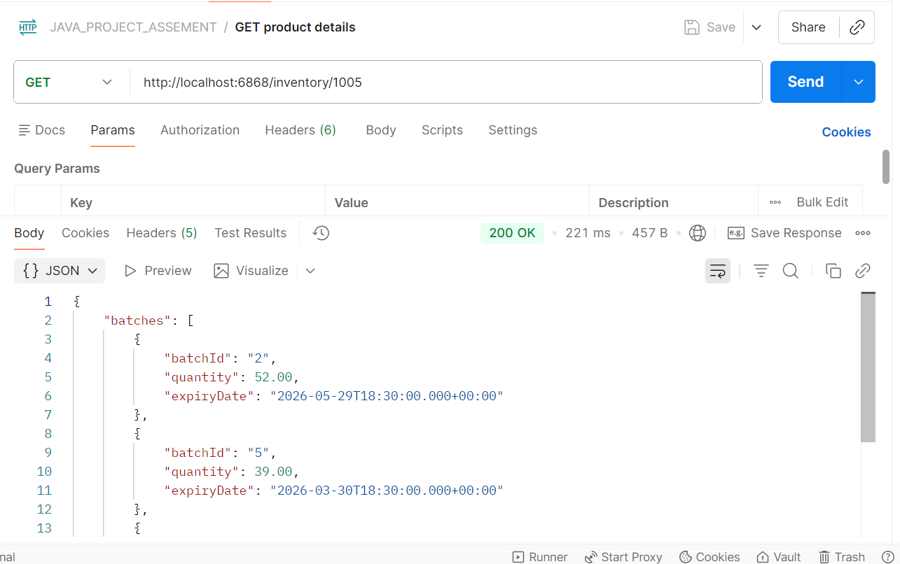
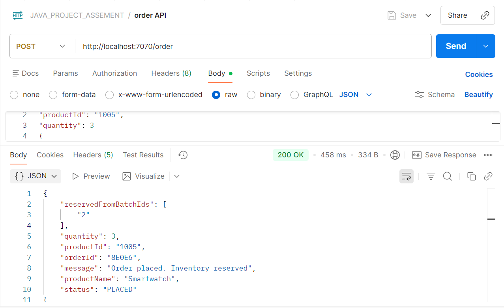
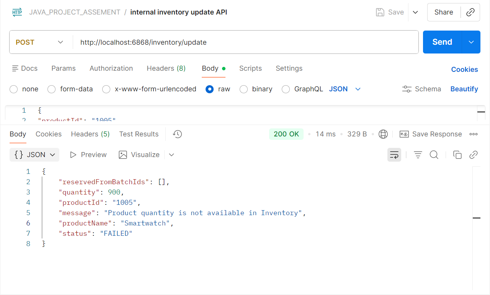

# Guide to test and Run (Windows)

This document explains how to build, run, and test the Inventory &  Order Service.

---

## Prerequisites

Make sure the following are installed:

- Java 17 or higher
- Port 6868 and 7070 available
- Postman
- Intellij IDE

## STEP -1
Check Java version:

```bash
java -version
```

-Sample Output

C:\nishi\JAVA_PROJECT\JARS>java --version

**java 17.0.12 2024-07-16 LTS**
Java(TM) SE Runtime Environment (build 17.0.12+8-LTS-286)
Java HotSpot(TM) 64-Bit Server VM (build 17.0.12+8-LTS-286, mixed mode, sharing)

If the version is not matching, use the below link to install correct java version

https://download.oracle.com/java/17/archive/jdk-17.0.12_windows-x64_bin.exe


## STEP -2

clone this repo ,and go to the JARS directory in cmd 

-Sample output


C:\nishi\JAVA_PROJECT\JARS>dir

Volume in drive C is Windows
Volume Serial Number is 90C9-46F1

Directory of C:\nishi\JAVA_PROJECT\JARS

14-02-2026  22:36    <DIR>          .
14-02-2026  22:45    <DIR>          ..
14-02-2026  22:35        54,422,268 inventory-0.0.1-NKP-SNAPSHOT.jar
14-02-2026  22:35        54,415,112 order-0.0.1-NKP-SNAPSHOT.jar
2 File(s)    108,837,380 bytes
2 Dir(s)  271,587,037,184 bytes free

Use below command to run the microservice 

## NOTE

Run both command in separate cmd window

```bash
java -jar inventory-0.0.1-NKP-SNAPSHOT.jar
```

```bash
java -jar order-0.0.1-NKP-SNAPSHOT.jar
```

to stop any microservice press ctrl+c on the cmd window

## STEP-3

use the attached postman collection in postmanCollection folder to test .

-fileName

JAVA_PROJECT_ASSEMENT.postman_collection


## STEP-4 (for testCase)

- note if you have maven installed in your PC the use the below command
```bash
mvn test
```

-Use IDE to test (I recommend this because if the complexity involving around maven installation)

-1 - install Intellij IDE   (recommended)

-2 - open respective microservice folder in separate Window

-3- right click on test/java folder and click **RUN TEST**


-STEP -5 (Request Response ScreenShots)










Thank you Very Much for selecting me , for the assignment round.

I Enjoyed building it from Starch .  

The exact expectation helped a lot during design phase.
Though it seemed simple at first glance,But scaling it for a production environment nonetheless was a good exercise. (# Shout out to the problem setter. HATS OFF)

P.S : Due to unavailability of MAC device , MAC device steps are not added 

For any issues / quires directly reach out to me on mobile or mail (niship059@gmail.com)
